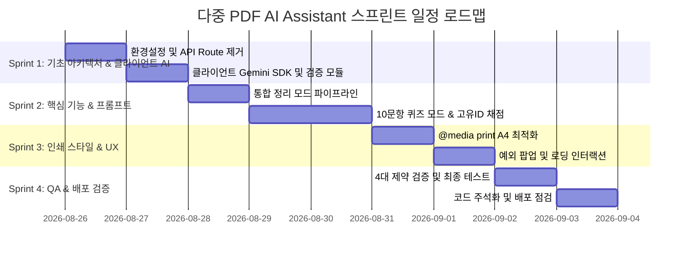

# 다중 PDF AI 학습 도우미 (PDF AI Assistant) 개발 계획서

본 문서는 루트 디렉터리의 `PRD.md`에 정의된 요구사항 및 기술적 제약 사항을 100% 준수하여, 확장 가능하고 완성도 높은 웹 애플리케이션을 단계별로 구축하기 위한 스프린트(Sprint) 단위 개발 계획서입니다.

---

## 1. 프로젝트 개요 및 아키텍처 원칙

### 1.1 프로젝트 목표
다중 PDF 문서를 업로드하여 누락 없는 **통합 정리 마크다운 노트**를 생성하거나, 학습을 위한 **10문항 객관식 랜덤 퀴즈 및 즉시 채점**을 지원하는 순수 프론트엔드 기반 AI 학습 도우미 웹 애플리케이션 구축.

### 1.2 핵심 아키텍처 원칙 (PRD 필수 제약 사항 4가지 준수)
| 제약 사항 번호 | 핵심 요구사항 | 구현 원칙 및 해결 방안 |
| :--- | :--- | :--- |
| **제약 1** | **백엔드/서버리스 금지** | Vercel의 Serverless 용량(4.5MB) 및 실행 시간(10초) 제한을 회피하기 위해, API Route를 거치지 않고 브라우저 클라이언트에서 직접 Gemini API(`gemini-1.5-flash`)를 호출 (`NEXT_PUBLIC_GEMINI_API_KEY` 활용) |
| **제약 2** | **경량 PDF 저장 (`@media print`)** | `html2pdf.js` 등 번들 크기가 큰 무거운 라이브러리 사용을 전면 배제하고, `window.print()`와 CSS `@media print`를 통해 브라우저 네이티브 A4 인쇄/PDF 저장 구현 |
| **제약 3** | **고유 ID 기반 채점 및 셔플 리셋** | 문제 배열 인덱스가 아닌 문항 고유 `id` 기준으로 사용자 답안 state(`Record<number, number>`)를 바인딩하고, [문제 섞어 다시 풀기] 시 답안 state를 완벽 초기화 |
| **제약 4** | **클라이언트 사전 용량 차단** | API 호출 전 브라우저단에서 파일 총합 10MB 초과 또는 텍스트 15,000자 초과 여부를 즉시 검사하여 조건 미달 시 요청 전면 차단 및 경고 토스트/알림 노출 |

---

## 2. 기술 스택 및 환경 정의

- **Framework**: Next.js (App Router, Client Components)
- **Language**: TypeScript 5+
- **Styling**: Tailwind CSS, Vanilla CSS (`@media print` 커스텀 스타일)
- **UI Components**: Radix UI / Shadcn UI (`Button`, `Card`, `Tabs`, `AlertDialog`, `Badge`, `Progress`, `Skeleton`, `Sonner`)
- **AI SDK / API**: `@google/generative-ai` (브라우저 직접 호출, `gemini-1.5-flash` 모델)
- **Markdown Renderer**: `react-markdown`, `remark-gfm`
- **Icon**: `lucide-react`

---

## 3. 스프린트(Sprint) 세부 계획 문서 링크

각 스프린트별 상세 요구사항 및 완료 기준(DoD)은 아래 개별 문서에서 확인하실 수 있습니다.

| 스프린트 | 문서 링크 | 핵심 주제 | 진행 상태 |
| :--- | :--- | :--- | :--- |
| **Sprint 1** | [SPRINT1.md](file:///c:/Users/zzang/Desktop/%EC%A7%81%EB%AC%B4/pdf-ai-assistant/docs/SPRINT1.md) | 기반 아키텍처 및 클라이언트 AI 연동 계층 구축 (제약 1, 4) | ✅ 완료 (100%) |
| **Sprint 2** | [SPRINT2.md](file:///c:/Users/zzang/Desktop/%EC%A7%81%EB%AC%B4/pdf-ai-assistant/docs/SPRINT2.md) | 핵심 모드 기능 구현 및 프롬프트 엔지니어링 (제약 3) | ✅ 완료 (100%) |
| **Sprint 3** | [SPRINT3.md](file:///c:/Users/zzang/Desktop/%EC%A7%81%EB%AC%B4/pdf-ai-assistant/docs/SPRINT3.md) | 네이티브 인쇄 스타일링(@media print) 및 UI/UX 고도화 (제약 2) | ✅ 완료 (100%) |
| **Sprint 4** | [SPRINT4.md](file:///c:/Users/zzang/Desktop/%EC%A7%81%EB%AC%B4/pdf-ai-assistant/docs/SPRINT4.md) | 예외 처리 완성, 통합 검증 및 문서화 | ✅ 완료 (100%) |

---

## 4. 로드맵 (Gantt Chart)

---

## 5. 제약 사항별 코드 구현 매핑 체크리스트

| 제약 번호 | 제약 명칭 | 소스코드 반영 위치 | 구현 내용 |
| :--- | :--- | :--- | :--- |
| **제약 1** | 백엔드/서버리스 금지 | `lib/gemini-client.ts`, `components/pdf-study-app.tsx` | Next.js API Routes 완전 제거, 클라이언트에서 직접 `@google/generative-ai` 호출 |
| **제약 2** | 네이티브 인쇄 / `@media print` | `app/globals.css`, `components/pdf-study-app.tsx` | `window.print()` 호출, `@media print` A4 규격 및 `.print:hidden` 완벽 적용 |
| **제약 3** | 고유 ID 기반 퀴즈 채점 & 셔플 리셋 | `components/pdf-study-app.tsx` | `q.id`를 키로 답안 저장, 셔플 시 `setUserAnswers({})` 초기화 |
| **제약 4** | 용량 및 텍스트량 사전 차단 | `lib/gemini-client.ts`, `components/pdf-study-app.tsx` | 파일 10MB / 텍스트 15,000자 초과 검증 후 사전 throw 및 Alert 차단 |
