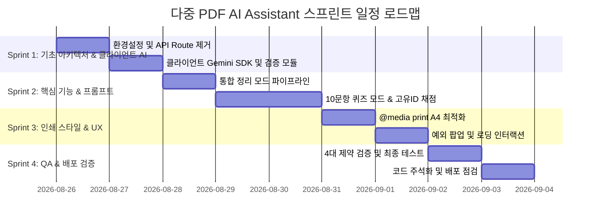

# 다중 PDF AI 학습 도우미 (PDF AI Assistant) 개발 계획서

본 문서는 루트 디렉터리의 `PRD.md`에 정의된 요구사항 및 기술적 제약 사항을 100% 준수하여, 확장 가능하고 완성도 높은 웹 애플리케이션을 단계별로 구축하기 위한 스프린트(Sprint) 단위 개발 계획서입니다.

---

## 1. 프로젝트 개요 및 아키텍처 원칙

### 1.1 프로젝트 목표
다중 PDF 문서를 업로드하여 누락 없는 **통합 정리 마크다운 노트**를 생성하거나, 학습을 위한 **10문항 객관식 랜덤 퀴즈 및 즉시 채점**을 지원하는 순수 프론트엔드 기반 AI 학습 도우미 웹 애플리케이션 구축.

### 1.2 핵심 아키텍처 원칙 (PRD 필수 제약 사항 4가지 준수)
| 제약 사항 번호 | 핵심 요구사항 | 구현 원칙 및 해결 방안 |
| :--- | :--- | :--- |
| **제약 1** | **백엔드/서버리스 금지** | Vercel의 Serverless 용량(4.5MB) 및 실행 시간(10초) 제한을 회피하기 위해, API Route를 거치지 않고 브라우저 클라이언트에서 직접 Gemini API(`gemini-1.5-flash`)를 호출 (`NEXT_PUBLIC_GEMINI_API_KEY` 활용) |
| **제약 2** | **경량 PDF 저장 (`@media print`)** | `html2pdf.js` 등 번들 크기가 큰 무거운 라이브러리 사용을 전면 배제하고, `window.print()`와 CSS `@media print`를 통해 브라우저 네이티브 A4 인쇄/PDF 저장 구현 |
| **제약 3** | **고유 ID 기반 채점 및 셔플 리셋** | 문제 배열 인덱스가 아닌 문항 고유 `id` 기준으로 사용자 답안 state(`Record<number, number>`)를 바인딩하고, [문제 섞어 다시 풀기] 시 답안 state를 완벽 초기화 |
| **제약 4** | **클라이언트 사전 용량 차단** | API 호출 전 브라우저단에서 파일 총합 10MB 초과 또는 텍스트 15,000자 초과 여부를 즉시 검사하여 조건 미달 시 요청 전면 차단 및 경고 토스트/알림 노출 |

---

## 2. 기술 스택 및 환경 정의

- **Framework**: Next.js (App Router, Client Components)
- **Language**: TypeScript 5+
- **Styling**: Tailwind CSS, Vanilla CSS (`@media print` 커스텀 스타일)
- **UI Components**: Radix UI / Shadcn UI (`Button`, `Card`, `Tabs`, `AlertDialog`, `Badge`, `Progress`, `Skeleton`, `Sonner`)
- **AI SDK / API**: `@google/genai` or `@google/generative-ai` (브라우저 직접 호출, `gemini-1.5-flash` 모델)
- **Markdown Renderer**: `react-markdown`, `remark-gfm`
- **Icon**: `lucide-react`

---

## 3. 스프린트(Sprint) 개발 계획



---

### Sprint 1: 기반 아키텍처 및 클라이언트 AI 연동 계층 구축
> **목표**: 서버리스 API Route 의존성을 완전히 제거하고, 프론트엔드 클라이언트에서 다중 PDF 파일을 Gemini API로 직접 전달하는 안전한 통신 파이프라인 구축

#### 태스크 목록
- [x] **1.1. 환경 변수 및 의존성 정비**
  - `.env.local` 및 `.env.example`에 `NEXT_PUBLIC_GEMINI_API_KEY` 설정 가이드 추가
  - `@google/generative-ai` SDK 패키지 설치 완료
- [x] **1.2. 기존 서버 API Route 제거/마이그레이션 (제약 1)**
  - PRD 제약 1에 따라 `app/api/summarize`, `app/api/quiz` 서버 라우트 완전 제거
  - 클라이언트 사이드 전용 AI 호출 헬퍼(`lib/gemini-client.ts`) 신규 작성
- [x] **1.3. PDF 전처리 및 클라이언트 사전 검증 로직 구현 (제약 4)**
  - 브라우저 `File` 객체들을 `inlineData`(Base64) 파트로 변환하는 비동기 유틸 작성
  - 파일 총합 10MB 초과 검사 및 텍스트 15,000자 초과 검사 로직 구현
  - 검증 실패 시 API 호출 사전 차단 및 한국어 에러 처리

#### 완료 기준 (DoD)
- Next.js 서버 라우트를 거치지 않고 브라우저에서 Gemini 1.5 Flash 모델로 PDF 데이터가 전송되는 클라이언트 파이프라인 구축 완료
- 10MB를 초과하는 파일 선택 시 API 요청 전 단계에서 차단 동작 확인

---

### Sprint 2: 핵심 모드 기능 구현 및 프롬프트 엔지니어링
> **목표**: 다중 PDF 통합 요약 모드와 10문항 객관식 퀴즈 생성 및 고유 ID 기반 채점/셔플 로직 완성

#### 태스크 목록
- [x] **2.1. 다중 PDF 통합 정리 모드 파이프라인**
  - "누락 없는 마크다운 통합 노트" 생성을 위한 시스템 프롬프트 작성
  - 마크다운 렌더러(`react-markdown`, `remark-gfm`) 연동 및 가독성 높은 노트 뷰어 구성
- [x] **2.2. 객관식 퀴즈 생성 및 Strict JSON 파싱**
  - PRD [응답 제약] 준수: 10개 객관식 문항의 엄격한 JSON 스키마 프롬프트 작성
    ```json
    [
      {
        "id": 1,
        "question": "문제 내용",
        "options": ["1번 보기", "2번 보기", "3번 보기", "4번 보기"],
        "answer": 2,
        "explanation": "해설 내용"
      }
    ]
    ```
  - JSON 마크다운 코드블록 래핑(` ```json ... ``` `) 제거 및 파싱 안전성 강화 로직
- [x] **2.3. 고유 ID 기반 퀴즈 상태 관리 및 채점 시스템 (제약 3)**
  - 답안 State를 `Record<number, number>` (Key: 문제 `id`, Value: 선택한 보기 1~4)로 설계
  - `[문제 섞어 다시 풀기]` 기능 구현:
    - `id` 기준 답안 상태 완벽 리셋 (`setUserAnswers({})`, `setIsGraded(false)`)
    - 문항 배열 셔플 (Fisher-Yates/랜덤 정렬 적용)
  - `[새로운 문제 생성]` 파이프라인 연동
- [x] **2.4. 미풀이 문항 채점 예외 처리**
  - 미풀이 문항 존재 시 `AlertDialog` 팝업("풀지 않은 문항이 있습니다. 계속 채점하시겠습니까?") 노출

#### 완료 기준 (DoD)
- 통합 정리 모드에서 Markdown 문서가 구조적으로 출력됨
- 퀴즈 모드에서 10문제가 정확한 JSON 포맷으로 생성되어 렌더링됨
- 문제를 섞은 후에도 각 문제의 고유 `id`에 맞춰 채점 및 해설이 정확하게 매칭됨

---

### Sprint 3: 네이티브 인쇄 스타일링(@media print) 및 UI/UX 고도화
> **목표**: 무거운 외부 라이브러리 없이 네이티브 `@media print`를 통한 고품질 A4 출력 구현 및 인터랙션 완성

#### 태스크 목록
- [x] **3.1. `@media print` 전용 CSS 구현 (제약 2)**
  - `globals.css` 내 인쇄 전용 스타일 시트 작성
  - 인쇄 시 숨겨야 할 요소 처리 (`.print:hidden`, 헤더, 탭 바, 파일 업로더, 액션 버튼, 네비게이션)
  - A4 규격 여백(`@page { size: A4; margin: 20mm; }`), 글꼴 크기, 줄 간격 및 페이지 넘김(`break-inside: avoid`) 최적화
- [x] **3.2. [PDF로 저장하기] 액션 바인딩**
  - 정리 노트 하단 `[PDF로 저장하기]` 버튼 클릭 시 `window.print()` 호출 트리거
- [x] **3.3. 상태 표시 및 로딩 인터랙션 고도화**
  - AI 생성(`Processing`) 진행 중 모든 입력창, 탭, 업로드, 버튼 완전 비활성화
  - 세련된 스켈레톤 및 로딩 스피너 애니메이션 표시
- [x] **3.4. 반응형 레이아웃 및 디자인 폴리싱**
  - 데스크톱/태블릿/모바일 반응형 UI 지원
  - API Key 직접 입력 팝업/토글 및 로컬 스토리지 연동 추가

#### 완료 기준 (DoD)
- [PDF로 저장하기] 클릭 시 브라우저 인쇄 미리보기에 정리 노트 본문만 깔끔하게 A4 레이아웃으로 표시됨
- API 처리 중 모든 UI 컴포넌트 비활성화 및 스피너 정상 표시

---

### Sprint 4: 예외 처리 완성, 통합 검증 및 문서화
> **목표**: PRD 필수 예외 4종 완벽 대응, 4대 기술적 제약 코드 주석 반영 및 배포 준비

#### 태스크 목록
- [x] **4.1. PRD 필수 예외 4종 시나리오 종합 점검**
  1. 빈 입력: 파일 미선택 상태에서 요청 시 `"최소 하나 이상의 PDF 파일을 업로드해주세요."` 알림
  2. 용량 초과 차단: 10MB 또는 15,000자 초과 시 `"일회당 처리 가능한 분량을 초과했습니다. 분석을 차단합니다."` 차단
  3. 미풀이 채점: 미완료 상태 제출 시 팝업 확인창 동작
  4. 상태 표시: Processing 중 모든 버튼 비활성화
- [x] **4.2. 필수 기술적 제약 사항 4가지 코드 주석화**
  - 소스코드(`lib/gemini-client.ts`, `components/pdf-study-app.tsx`, `app/globals.css`) 내 `[기술적 제약 사항 1~4]` 명확한 설명 주석 기재
- [x] **4.3. 빌드 및 배포 검증**
  - TypeScript 컴파일 검사(`tsc --noEmit`) 무결성 확인
  - Vercel 배포 시 서버리스 페이로드 에러(4.5MB/10s timeout) 완전 배제 구조 확보

#### 완료 기준 (DoD)
- 모든 예외 케이스 및 PRD 요구사항 체크리스트 100% 통과
- `tsc` 정적 검사 통과 및 로컬 서버 정상 서빙 확인

---

## 4. 제약 사항별 코드 구현 매핑 체크리스트

| 제약 번호 | 제약 명칭 | 소스코드 반영 위치 | 구현 내용 |
| :--- | :--- | :--- | :--- |
| **제약 1** | 백엔드/서버리스 금지 | `lib/gemini-client.ts`, `components/pdf-study-app.tsx` | Next.js API Routes 완전 제거, 클라이언트에서 직접 `@google/generative-ai` 호출 |
| **제약 2** | 네이티브 인쇄 / `@media print` | `app/globals.css`, `components/pdf-study-app.tsx` | `window.print()` 호출, `@media print` A4 규격 및 `.print:hidden` 완벽 적용 |
| **제약 3** | 고유 ID 기반 퀴즈 채점 & 셔플 리셋 | `components/pdf-study-app.tsx` | `q.id`를 키로 답안 저장, 셔플 시 `setUserAnswers({})` 초기화 |
| **제약 4** | 용량 및 텍스트량 사전 차단 | `lib/gemini-client.ts`, `components/pdf-study-app.tsx` | 파일 10MB / 텍스트 15,000자 초과 검증 후 사전 throw 및 Alert 차단 |

---

## 5. 진척도 및 개발 상태 트래킹

- **Sprint 1 (기반 아키텍처 & 클라이언트 AI)**: ✅ 완료 (100%)
- **Sprint 2 (핵심 모드 & 고유 ID 퀴즈)**: ✅ 완료 (100%)
- **Sprint 3 (인쇄 스타일 & UI/UX)**: ✅ 완료 (100%)
- **Sprint 4 (예외 처리 & 최종 검증)**: ✅ 완료 (100%)
