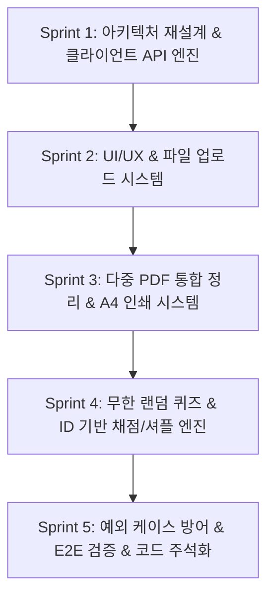

# 다중 PDF 통합 정리 및 앱 내 무한 랜덤 퀴즈 웹 앱 개발 계획서

본 문서는 `PRD.md`에 정의된 요구사항과 4대 기술적 제약 사항을 100% 준수하여 프로덕션 레벨의 웹 애플리케이션을 완성하기 위한 스프린트 단위의 상세 개발 계획서입니다.

---

## 📌 1. 프로젝트 개요 및 핵심 요구사항 매핑

### 🎯 프로젝트 목표
다중 PDF 문서를 업로드하여 AI(Gemini 1.5 Flash)를 통해 **누락 없는 마크다운 통합 정리 노트**를 생성하고, 학습 효과 극대화를 위한 **10문항 무한 랜덤 객관식 퀴즈 및 정밀 채점/셔플 기능**을 제공하는 올인원 학습 보조 웹 애플리케이션 구축.

### 🛡️ 4대 기술적 제약 사항 및 구현 전략

| # | 제약 사항 | 상세 내용 | 대응 구현 방안 |
|---|---|---|---|
| **1** | **백엔드/서버리스 금지** | Vercel의 4.5MB/10초 페이로드 및 타임아웃 제한 회피 | API Route를 완전히 배제하고 브라우저(Frontend)에서 `@google/genai` 또는 Gemini REST API를 직접 호출. 환경변수(`NEXT_PUBLIC_GEMINI_API_KEY`) 관리. |
| **2** | **PDF 저장 방식** | `html2pdf.js` 등 무거운 DOM 캡처 라이브러리 사용 절대 금지 | `window.print()` 트리거 및 전용 `@media print` CSS 작성. 인쇄 시 네비게이션, 업로더, 버튼 등 UI 요소를 숨기고 본문만 A4 규격에 맞추어 출력. |
| **3** | **셔플 및 상태 관리** | [문제 섞어 다시 풀기] 시 이전 답안 잔존 방지 및 셔플 후 인덱스 꼬임 방지 | 셔플 실행 시 `userAnswers` 상태를 즉시 빈 객체(`{}`)로 초기화. 채점 시 배열 인덱스가 아닌 문항 고유 `id` 기준으로 판별. |
| **4** | **용량 차단 로직** | API 비용 낭비 및 브라우저 크래시 방지 | API 호출 전 클라이언트 측에서 업로드 파일 총합 10MB 또는 텍스트 15,000자 초과 여부를 사전 검사하여 즉시 차단 및 경고 토스트/모달 출력. |

---

## 🏃 2. 스프린트별 개발 계획 (Sprint Breakdown)



---

### 🚀 Sprint 1: 아키텍처 전환 및 클라이언트 AI 엔진 구축
> **목표**: 백엔드 API 라우트 의존성을 완전히 제거하고, 브라우저에서 직접 Gemini 1.5 Flash와 통신하는 순수 클라이언트 SDK 엔진 및 용량 검증 모듈 구축

- [ ] **기존 API 라우트 마이그레이션/정리**
  - 기존 `app/api/summarize/route.ts` 및 `app/api/quiz/route.ts` 제거
  - Next.js 서버리스 환경의 타임아웃/페이로드 제한 요소 완전 배제
- [ ] **클라이언트 Gemini 클라이언트 유틸리티 (`lib/gemini-client.ts`) 구현**
  - `@google/genai` 또는 Gemini 1.5 Flash REST API 직접 연동
  - `NEXT_PUBLIC_GEMINI_API_KEY` 환경변수 처리 및 런타임 유효성 검사
  - PDF File 객체를 Gemini가 지원하는 `inlineData (base64, application/pdf)` 파트로 변환하는 최적화 브라우저 파서 작성
- [ ] **용량 및 텍스트 사전 검증 시스템 (`lib/validators.ts`)**
  - 총 파일 용량 10MB (`10 * 1024 * 1024 bytes`) 초과 감지 로직
  - 텍스트 추출 시 15,000자 초과 여부 체크 로직
  - 초과 시 API 요청 진입을 완전히 차단하는 Guard 함수 작성
- [ ] **Sprint 1 완료 기준 (DoD)**:
  - 브라우저 콘솔 및 단위 테스트에서 샘플 PDF(10MB 이하)를 프론트엔드 단독으로 Gemini 1.5 Flash에 전송하여 응답을 정상 수신하는지 검증 완료.

---

### 🎨 Sprint 2: UI/UX 고도화 및 파일 관리 인터페이스
> **목표**: 다중 PDF 업로드 관리, 탭 모드 전환, 실시간 용량 모니터링 및 상태별 잠금(Locking) UI 구현

- [ ] **탭 네비게이션 및 모드 상태 관리**
  - [다중 PDF 통합 정리 모드] / [앱 내 무한 랜덤 퀴즈 & 채점 모드] 탭 UI
  - 모드 전환 시 이전 상태 보존 및 상황별 초기화 로직
- [ ] **다중 파일 업로더 컴포넌트**
  - `multiple` 속성 지원 파일 입력창 및 드래그 앤 드롭 영역
  - 파일 리스트 뷰 (파일명, 파일별 용량, 삭제 버튼, 전체 삭제)
  - 실시간 누적 용량 프로그레스 바 (10MB 기준 백분율 및 경고 시각화)
- [ ] **글로벌 로딩 및 인터랙션 제어 시스템**
  - AI 분석/생성 중 (`isLoading === true`) 모든 입력창, 탭, 버튼 비활성화 (Disabled)
  - 세련된 로딩 스피너 및 단계별 진행 메시지 ("PDF 파싱 중...", "Gemini 분석 중...")
- [ ] **Sprint 2 완료 기준 (DoD)**:
  - 여러 PDF를 추가/삭제하고 10MB 초과 시 업로드가 차단되는 반응형 UI 구현 완료.

---

### 📄 Sprint 3: 다중 PDF 통합 정리 모드 & A4 인쇄 최적화
> **목표**: 누락 없는 마크다운 통합 노트 생성 프롬프트 엔지니어링 및 `window.print()` 기반 인쇄 시스템 구현

- [ ] **통합 정리 프롬프트 엔지니어링**
  - 업로드된 다수의 PDF 내용을 하나도 누락하지 않고 구조화된 마크다운(헤딩, 불릿, 표, 강조)으로 종합 정리하도록 시스템 프롬프트 설계
  - 스트리밍 또는 완성형 마크다운 응답 처리
- [ ] **마크다운 뷰어 및 렌더링 최적화**
  - `react-markdown` + `remark-gfm`을 활용한 깔끔한 타이포그래피 스타일링
  - 복사하기, 정리 내용 재분석 트리거
- [ ] **A4 규격 `@media print` 스타일 시트 작성**
  - 네비게이션 바, 업로드 영역, 모드 탭, 조작 버튼, 푸터 등 인쇄 시 불필요한 UI 숨김 (`display: none !important`)
  - 인쇄 용지 규격 지정 (`@page { size: A4 portrait; margin: 15mm; }`)
  - 페이지 분할 방지 및 폰트/여백 가독성 최적화 (`break-inside: avoid`, `color: #000`)
- [ ] **[PDF로 저장하기] 버튼 액션 연결**
  - `window.print()` 호출 트리거 구현 (`html2pdf.js` 일체 미사용 검증)
- [ ] **Sprint 3 완료 기준 (DoD)**:
  - 정리된 내용에서 [PDF로 저장하기] 클릭 시 브라우저 인쇄 창이 열리고 A4에 정리 노트 본문만 깨끗하게 출력되는지 확인.

---

### 🎲 Sprint 4: 10문항 랜덤 퀴즈 & ID 기반 정밀 채점/셔플 엔진
> **목표**: 엄격한 JSON 배열 포맷 보장, 고유 ID 기반 채점 및 완벽한 답안 리셋 셔플 로직 구현

- [ ] **퀴즈 생성 프롬프트 및 응답 스키마 강제**
  - PRD 명시 JSON 스키마 강제:
    ```json
    [
      {
        "id": 1,
        "question": "문제 내용",
        "options": ["1번 보기", "2번 보기", "3번 보기", "4번 보기"],
        "answer": 2,
        "explanation": "해설 내용"
      }
    ]
    ```
  - AI 응답 내 마크다운 백틱 제거 및 JSON 파싱 방어 코드 구현
- [ ] **고유 `id` 기반 채점 상태 관리 (`userAnswers: Record<number, number>`)**
  - 문항 선택 시 `userAnswers[question.id] = selectedOptionIndex` 형태로 바인딩
  - 배열 인덱스가 아닌 `q.id`를 기준으로 정답(`q.answer`)과 비교하는 채점 엔진 작성
- [ ] **예외 처리 팝업 (AlertDialog)**
  - 미풀이 문항 존재 시 "풀지 않은 문항이 있습니다. 계속 채점하시겠습니까?" 컨펌 다이얼로그 노출
  - 확인 시 미풀이 문항은 오답 처리 후 즉시 채점 진행
- [ ] **[문제 섞어 다시 풀기] Fisher-Yates 셔플 엔진**
  - 버튼 클릭 시 `userAnswers` 상태를 `{}`로 완전 리셋
  - `isGraded` 상태 `false`로 리셋
  - 문제 배열을 무작위 셔플하되 각 문제의 `id`와 `answer` 매핑은 온전히 유지
- [ ] **[새로운 문제 생성] 및 [답안 제출 및 채점하기] 버튼 기능**
  - 채점 완료 시 점수 표시 바, 문항별 정답/오답 컬러링 (Green/Red) 및 상세 해설 박스 노출
  - [새로운 문제 생성] 클릭 시 동일 PDF로부터 신규 10문항 재생성 요청
- [ ] **Sprint 4 완료 기준 (DoD)**:
  - 퀴즈 풀기 -> 미풀이 경고 다이얼로그 -> 채점 -> 해설 확인 -> 셔플 시 답안 리셋 및 id 기반 정확한 재채점 동작 검증 완료.

---

### 🛡️ Sprint 5: 예외 처리 완성, 기술 제약 검증 및 코드 주석화
> **목표**: 4대 필수 지시문 코드 주석 명시, 에지 케이스 방어, 번들 최적화 및 최종 배포 검증

- [ ] **PRD 필수 예외 처리 항목 전수 검증**
  - [x] 빈 파일 입력 검사: `"최소 하나 이상의 PDF 파일을 업로드해주세요."`
  - [x] 용량 초과 차단: `"일회당 처리 가능한 분량을 초과했습니다. 분석을 차단합니다."`
  - [x] 미풀이 채점 확인 다이얼로그: `"풀지 않은 문항이 있습니다. 계속 채점하시겠습니까?"`
  - [x] Processing 중 버튼 비활성화 및 로딩 스피너
- [ ] **기술적 제약 사항 4가지 주석 문서화 (PRD 40번 지시사항)**
  - 코드 내 `[기술적 제약 사항 1/2/3/4 반영]` 주석 명확히 표기
- [ ] **빌드 및 린트 검증**
  - TypeScript 컴파일 에러 및 빌드 에러 (`pnpm build`) 0건 달성
- [ ] **Sprint 5 완료 기준 (DoD)**:
  - 모든 요구조건 및 4대 기술적 제약 사항이 완벽히 동작하며 프로덕션 빌드 완료.

---

## 📊 3. 스프린트 일정 및 우선순위 매트릭스

| 스프린트 | 핵심 산출물 | 예상 난이도 | 우선순위 |
|---|---|:---:|:---:|
| **Sprint 1** | `lib/gemini-client.ts`, `lib/validators.ts`, API Route 제거 | 높음 | P0 (Critical) |
| **Sprint 2** | `components/pdf-study-app.tsx` UI 골격, 파일 업로더, 상태바 | 중간 | P0 (Critical) |
| **Sprint 3** | 마크다운 정리 뷰어, `globals.css` @media print, 인쇄 버튼 | 중간 | P1 (High) |
| **Sprint 4** | 10문항 퀴즈 뷰, ID 기반 채점기, Fisher-Yates 셔플러, 해설 모달 | 높음 | P0 (Critical) |
| **Sprint 5** | 통합 예외 처리, 기술 제약 4대 주석 작성, E2E 검증 | 낮음 | P1 (High) |

---

## 🔍 4. 향후 유지보수 및 확장 가이드

1. **Gemini 모델 업그레이드**: `lib/gemini-client.ts`의 `MODEL_NAME` 상수를 수정하여 `gemini-1.5-flash`에서 향후 최신 모델로 손쉽게 전환 가능.
2. **프롬프트 템플릿 분리**: `lib/prompts.ts`에 요약 프롬프트와 퀴즈 생성 프롬프트를 별도 관리하여 유지보수성 향상.
3. **오답 노트 내보내기**: 향후 오답 문항만 모아서 별도 PDF로 인쇄/저장하는 기능 추가 고려.
